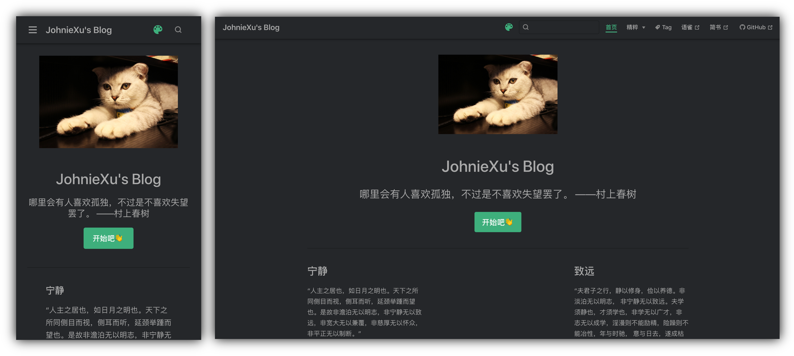

# xx-blog

> 个人博客项目，项目地址：https://blog.lessing.online/ （备用地址：https://www.lessing.online/xx-blog/ 这是github的pages服务）

<p align="center">
  
</p>

<p align="center">
  
</p>

## install

```bash
npm i || yarn
```

## publish

- publish to github

采用gh-pages推送到github pages

```bash
npm run deploy:build || yarn deploy:build
```

- publish to coding

1. step1

    更新代码， 提交到github、coding的master分支， 然后**打包静态资源**

    ```bash
    git add .
    git commit -m update
    git push coding master
    npm run docs:build
    ```

2. step2

    关联远程的coding项目仓库（可选）

    ```bash
    git remote add coding git@git.coding.net:JohnieXu/xx-blog.git
    git checkout coding-pages || git checkout -b coding-pages coding/coding-pages
    ```

3. step3

    将上面打包的静态资源**拷贝到项目外的文件夹下临时存储**， 切换到coding-pages分支， 然后用step1中build产生dist目录下的所有文件覆盖coding-pages分支下项目根目录下的文件

    > coding-pages分支为coding的静态文件服务，此分支放置打包后的静态资源文件

    然后push更新

    ```bash
    git add .
    git commit -m udpate
    git push coding coding-pages
    ```
